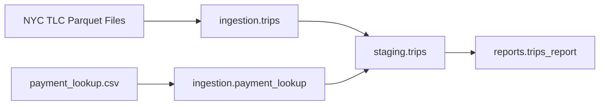

# NYC Taxi ELT Pipeline with Bruin

Personal project built while following **[Data Engineering Zoomcamp](https://datatalks.club/blog/data-engineering-zoomcamp.html)** — a free, hands-on data engineering course by [DataTalks.Club](https://datatalks.club/).

This repository implements **Module 5: Data Platforms** using [Bruin](https://getbruin.com/) — an end-to-end NYC Taxi ELT pipeline with ingestion, staging, reporting, and data quality checks. Runs locally on **DuckDB** or in the cloud on **MotherDuck**.

## Course Context

| Item | Detail |
|------|--------|
| Course | [Data Engineering Zoomcamp 2026](https://datatalks.club/blog/data-engineering-zoomcamp.html) |
| Module | **Week 5 — Data Platforms** (Bruin, ingestion, transformation, quality, cloud deployment) |
| Dataset | NYC TLC Yellow & Green taxi trip data (public parquet files) |
| Author | [Zakariae Jaafari](https://github.com/ZakariaeJaafari) |

## What I Built

A production-style **ELT pipeline** with three layers:



### Ingestion layer

- **`ingestion.trips`** (`trips.py`) — Python asset that:
  - Fetches monthly parquet files from the TLC CDN
  - Reads `BRUIN_START_DATE` / `BRUIN_END_DATE` and the `taxi_types` pipeline variable
  - Normalizes yellow (`tpep_*`) and green (`lpep_*`) datetime columns
  - Caches downloaded files under `pipeline/assets/ingestion/cache/`
  - **Yields 150k-row PyArrow batches** via a generator (handles large months like 2020-01 with 6.4M+ rows)
  - Uses **`append`** materialization (duplicates handled in staging)

- **`ingestion.payment_lookup`** — Seed asset that loads payment type codes from CSV

### Staging layer

- **`staging.trips`** (`trips.sql`) — SQL asset that:
  - Filters trips to the run time window
  - Drops invalid rows (null datetimes, negative fares/distances)
  - Joins payment lookup for human-readable payment names
  - **Deduplicates** with `ROW_NUMBER()` on a composite key
  - Uses **`time_interval`** incremental strategy on `pickup_datetime`
  - Runs column checks + a custom uniqueness check

### Reports layer

- **`reports.trips_report`** (`trips_report.sql`) — SQL asset that:
  - Aggregates by **trip date**, **taxi type**, and **payment type**
  - Computes `trip_count`, `total_fare_amount`, `total_trip_distance`
  - Uses **`time_interval`** on `trip_date`

## Tech Stack

| Tool | Role |
|------|------|
| [Bruin CLI](https://getbruin.com/docs/bruin/) | Pipeline orchestration, validation, execution |
| DuckDB | Local warehouse (`default` environment) |
| [MotherDuck](https://motherduck.com/) | Cloud DuckDB (`production` environment) |
| Python 3.11 | Ingestion (`pyarrow`, `python-dateutil`) |
| SQL | Staging & reporting transformations |

## Project Structure

```text
DataPlatforme-Bruin/
├── .bruin.yml              # Local config (gitignored) — copy from .bruin.yml.example
├── .bruin.yml.example      # Template: default (DuckDB) + production (MotherDuck)
├── .env.example            # MOTHERDUCK_TOKEN placeholder
├── MOTHERDUCK_SETUP.md     # Cloud setup guide
├── scripts/
│   └── run-production.sh   # Loads .env, runs MotherDuck pipeline
├── README.md
└── pipeline/
    ├── pipeline.yml
    └── assets/
        ├── ingestion/
        │   ├── trips.py
        │   ├── requirements.txt
        │   ├── payment_lookup.asset.yml
        │   ├── payment_lookup.csv
        │   └── cache/      # Parquet cache (gitignored)
        ├── staging/
        │   └── trips.sql
        └── reports/
            └── trips_report.sql
```

## Environments

| Environment | Flag | Destination |
|-------------|------|-------------|
| `default` | `-e default` | Local `duckdb.db` |
| `production` | `-e production` | MotherDuck database `nyc_taxi` |

Both use the same connection name (`duckdb-default`) and the same asset code.

## Pipeline Configuration

`pipeline/pipeline.yml`:

- **Name:** `nyc-taxi-pipeline`
- **Schedule:** `monthly`
- **Start date:** `2022-01-01`
- **Variable:** `taxi_types` — `yellow` / `green` (default: both)

## How to Run

### Prerequisites

```bash
bruin --version
cp .bruin.yml.example .bruin.yml   # if needed
```

### Validate

```bash
bruin validate ./pipeline/pipeline.yml --environment default
```

### Local (DuckDB)

```bash
bruin run ./pipeline/pipeline.yml \
  --environment default \
  --full-refresh \
  --start-date 2022-01-01 \
  --end-date 2022-02-01 \
  --var 'taxi_types=["yellow"]'
```

### Cloud (MotherDuck)

See [MOTHERDUCK_SETUP.md](./MOTHERDUCK_SETUP.md) for token and Bruin Cloud setup.

```bash
cp .env.example .env   # add MOTHERDUCK_TOKEN=md_...

./scripts/run-production.sh \
  --full-refresh \
  --start-date 2022-01-01 \
  --end-date 2022-02-01 \
  --var 'taxi_types=["yellow"]' \
  --force
```

Large historical months (e.g. 2020-01):

```bash
./scripts/run-production.sh \
  --full-refresh \
  --start-date 2020-01-01 \
  --end-date 2020-02-01 \
  --var 'taxi_types=["yellow"]' \
  --force
```

### Query results

```bash
# Local
bruin query --connection duckdb-default --environment default \
  --query "SELECT COUNT(*) FROM ingestion.trips"

# MotherDuck
bruin query --connection duckdb-default --environment production \
  --query "SELECT COUNT(*) FROM reports.trips_report"
```

## Verified Results

### Local DuckDB — January 2022, yellow

| Layer | Rows |
|-------|------|
| `ingestion.trips` | 2,463,931 |
| `staging.trips` | 2,450,940 |
| `reports.trips_report` | 156 |

### MotherDuck — January 2020, yellow (6.4M rows, 43 batches)

| Layer | Rows |
|-------|------|
| `ingestion.trips` | 6,405,008 |
| `staging.trips` | ~6.4M (after dedup + invalid row filter) |
| `reports.trips_report` | daily aggregates |

All **4 assets** and quality checks passed on both environments.

## Design Decisions

1. **Append at ingestion, dedupe at staging** — raw landing zone stays simple
2. **Generator + PyArrow batches** — avoids Bruin's ~256 MB Arrow IPC limit on large months
3. **Local parquet cache** — skip re-downloads during development
4. **Column pruning** — only fields needed downstream
5. **Composite dedup key** — no unique trip ID in TLC data
6. **Dual environments** — same pipeline code, DuckDB locally / MotherDuck in cloud
7. **`--workers 1` on Windows** — avoids MotherDuck extension install race

## What's Next

- [x] Local DuckDB pipeline (ingestion → staging → reports)
- [x] MotherDuck production environment + chunked ingestion
- [ ] Bruin Cloud scheduling — see [MOTHERDUCK_SETUP.md](./MOTHERDUCK_SETUP.md)
- [ ] Deploy to **BigQuery** (alternative cloud path)
- [ ] Backfill additional months / years

## References

- [Data Engineering Zoomcamp](https://datatalks.club/blog/data-engineering-zoomcamp.html)
- [DE Zoomcamp GitHub](https://github.com/DataTalksClub/data-engineering-zoomcamp)
- [Bruin Documentation](https://getbruin.com/docs/bruin/)
- [MotherDuck setup](./MOTHERDUCK_SETUP.md)
- [Bruin MotherDuck docs](https://getbruin.com/docs/bruin/platforms/motherduck)
- [NYC TLC Trip Record Data](https://www.nyc.gov/site/tlc/about/tlc-trip-record-data.page)
