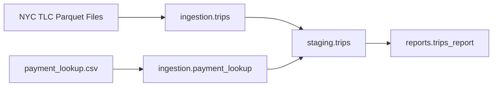

# NYC Taxi ELT Pipeline with Bruin

Personal project built while following **[Data Engineering Zoomcamp](https://datatalks.club/blog/data-engineering-zoomcamp.html)** — a free, hands-on data engineering course by [DataTalks.Club](https://datatalks.club/).

This repository implements **Module 5: Data Platforms** using [Bruin](https://getbruin.com/) — an end-to-end NYC Taxi ELT pipeline with ingestion, staging, reporting, and data quality checks, running locally on DuckDB.

## Course Context

| Item | Detail |
|------|--------|
| Course | [Data Engineering Zoomcamp 2026](https://datatalks.club/blog/data-engineering-zoomcamp.html) |
| Module | **Week 5 — Data Platforms** (Bruin, ingestion, transformation, quality, cloud deployment) |
| Dataset | NYC TLC Yellow & Green taxi trip data (public parquet files) |
| Author | [Zakariae Jaafari](https://github.com/ZakariaeJaafari) |

## What I Built

A production-style **ELT pipeline** with three layers:



### Ingestion layer

- **`ingestion.trips`** (`trips.py`) — Python asset that:
  - Fetches monthly parquet files from the TLC CDN
  - Reads `BRUIN_START_DATE` / `BRUIN_END_DATE` and the `taxi_types` pipeline variable
  - Normalizes yellow (`tpep_*`) and green (`lpep_*`) datetime columns
  - Caches downloaded files locally to avoid re-downloading
  - Uses **`append`** materialization (duplicates handled in staging)

- **`ingestion.payment_lookup`** — Seed asset that loads payment type codes from CSV

### Staging layer

- **`staging.trips`** (`trips.sql`) — SQL asset that:
  - Filters trips to the run time window
  - Joins payment lookup for human-readable payment names
  - **Deduplicates** with `ROW_NUMBER()` on a composite key
  - Uses **`time_interval`** incremental strategy on `pickup_datetime`
  - Runs column checks + a custom uniqueness check

### Reports layer

- **`reports.trips_report`** (`trips_report.sql`) — SQL asset that:
  - Aggregates by **trip date**, **taxi type**, and **payment type**
  - Computes `trip_count`, `total_fare_amount`, `total_trip_distance`
  - Uses **`time_interval`** on `trip_date`

## Tech Stack

| Tool | Role |
|------|------|
| [Bruin CLI](https://getbruin.com/docs/bruin/) | Pipeline orchestration, validation, execution |
| DuckDB | Local warehouse (`.bruin.yml` — not committed) |
| Python 3.11 | Ingestion (`pandas`, `pyarrow`, `python-dateutil`) |
| SQL | Staging & reporting transformations |

## Project Structure

```text
DataPlatforme-Bruin/
├── .bruin.yml                          # Local DuckDB connection (gitignored)
├── README.md
└── pipeline/
    ├── pipeline.yml                    # Pipeline config, schedule, variables
    └── assets/
        ├── ingestion/
        │   ├── trips.py                # TLC parquet ingestion
        │   ├── requirements.txt
        │   ├── payment_lookup.asset.yml
        │   ├── payment_lookup.csv
        │   └── cache/                  # Local parquet cache (gitignored)
        ├── staging/
        │   └── trips.sql               # Clean, dedupe, enrich
        └── reports/
            └── trips_report.sql        # Daily aggregates
```

## Pipeline Configuration

`pipeline/pipeline.yml`:

- **Name:** `nyc-taxi-pipeline`
- **Schedule:** `monthly`
- **Start date:** `2022-01-01`
- **Connection:** `duckdb-default`
- **Variable:** `taxi_types` — array of `yellow` / `green` (default: both)

## How to Run

### Prerequisites

```bash
# Install Bruin CLI — https://getbruin.com/docs/bruin/getting-started/installation
bruin --version

# Configure .bruin.yml at repo root with a DuckDB connection named duckdb-default
```

### Validate

```bash
bruin validate ./pipeline/pipeline.yml --environment default
```

### Run (dev — 1 month, yellow only)

```bash
bruin run ./pipeline/pipeline.yml \
  --environment default \
  --full-refresh \
  --start-date 2022-01-01 \
  --end-date 2022-02-01 \
  --var 'taxi_types=["yellow"]'
```

### Query results

```bash
bruin query --connection duckdb-default --query "SELECT COUNT(*) FROM ingestion.trips"
bruin query --connection duckdb-default --query "SELECT COUNT(*) FROM staging.trips"
bruin query --connection duckdb-default --query "SELECT * FROM reports.trips_report ORDER BY trip_count DESC LIMIT 10"
```

## Verified Results

Test run: **January 2022, yellow taxis only**

| Layer | Table | Rows |
|-------|-------|------|
| Ingestion | `ingestion.trips` | 2,463,931 |
| Staging | `staging.trips` | 2,450,940 |
| Reports | `reports.trips_report` | 156 |

All **4 assets** and **19 quality checks** passed.

## Design Decisions

1. **Append at ingestion, dedupe at staging** — raw landing zone stays simple; cleaning happens downstream
2. **Local parquet cache** — avoids re-downloading large TLC files during development
3. **Column pruning in ingestion** — loads only fields needed downstream to stay under Arrow transfer limits
4. **Composite dedup key** — `(pickup_datetime, dropoff_datetime, pickup_location_id, dropoff_location_id, fare_amount, taxi_type)` because TLC data has no unique trip ID
5. **Consistent time keys** — staging filters on `pickup_datetime`; reports aggregate to `trip_date`

## What's Next

- [ ] Deploy to **BigQuery** (swap `duckdb.sql` → `bq.sql`, update `.bruin.yml`)
- [ ] Schedule on **Bruin Cloud**
- [ ] Backfill additional months / years
- [ ] Add more report dimensions (e.g. pickup zone)

## References

- [Data Engineering Zoomcamp](https://datatalks.club/blog/data-engineering-zoomcamp.html)
- [DE Zoomcamp GitHub](https://github.com/DataTalksClub/data-engineering-zoomcamp)
- [Bruin Documentation](https://getbruin.com/docs/bruin/)
- [Bruin Zoomcamp Template](https://getbruin.com/docs/bruin/)
- [NYC TLC Trip Record Data](https://www.nyc.gov/site/tlc/about/tlc-trip-record-data.page)
